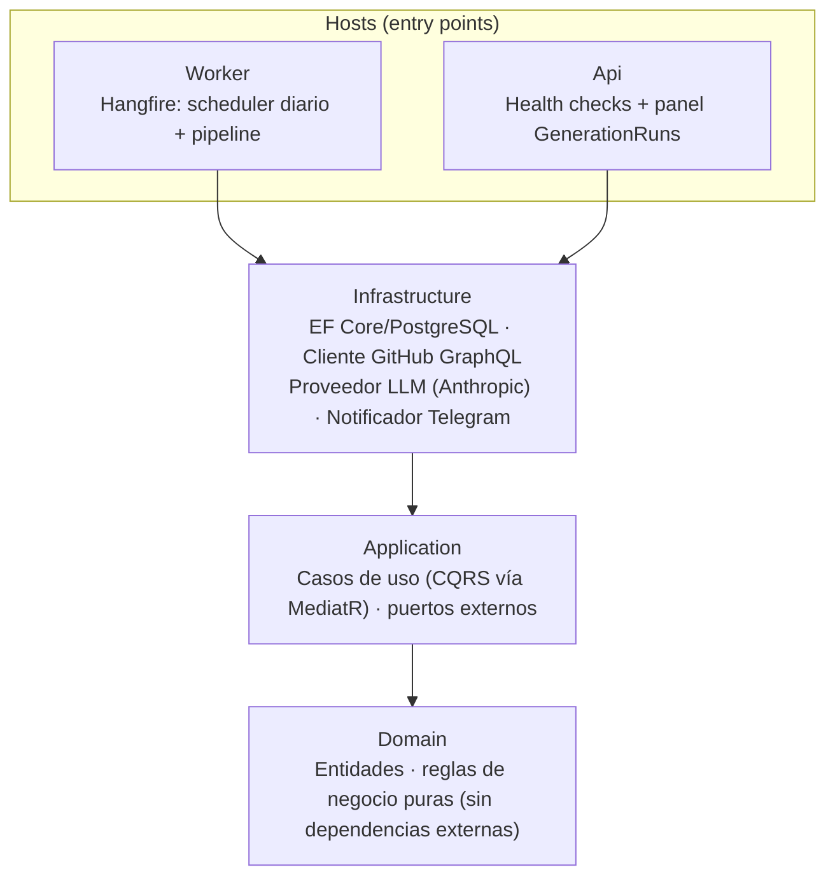
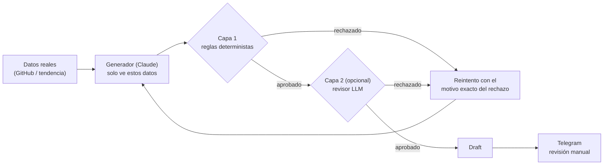
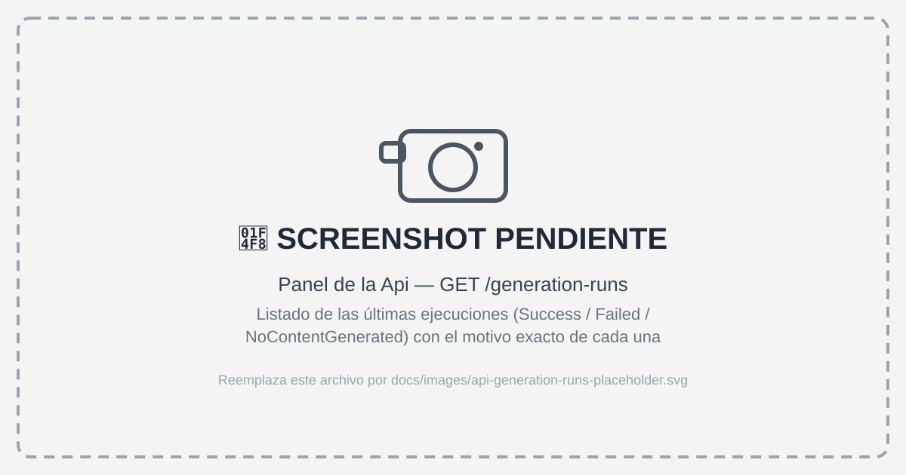

# Dev Content Engine

Todos los días a las 08:00 (Europe/Madrid), analiza tu actividad real de GitHub del día anterior y
prepara un borrador de post para LinkedIn a partir de ella. Nunca lo publica: el resultado de cada
ejecución es siempre un borrador que llega a Telegram para que lo revises, edites o descartes tú.


## Índice

- [Qué hace y qué no hace](#qué-hace-y-qué-no-hace)
- [Arquitectura](#arquitectura)
- [Cómo se evita que el contenido se invente cosas](#cómo-se-evita-que-el-contenido-se-invente-cosas)
- [Stack](#stack)
- [Cómo ejecutarlo localmente](#cómo-ejecutarlo-localmente)
- [Tests](#tests)
- [Roadmap](#roadmap)

## Qué hace y qué no hace

**Qué hace:**

- Cada día, ingesta la actividad real de un usuario de GitHub del día anterior (commits, pull
  requests, issues, releases) vía la API GraphQL de GitHub.
- Puntúa esa actividad y decide de forma determinista si hay suficiente sustancia para un post
  basado en el trabajo del día, si conviene apoyarse en una tendencia externa del sector, o —si
  tampoco hay tendencia disponible— destacar una característica ya implementada de uno de tus
  repositorios existentes ("repo highlight").
- Genera un borrador con un LLM (Anthropic Claude), a partir únicamente de los datos reales
  capturados — no de un prompt abierto.
- Valida ese borrador contra un conjunto de reglas deterministas (longitud, hashtags, frases
  prohibidas, trazabilidad de fuentes) antes de darlo por bueno.
- Registra cada ejecución (éxito, fallo, o "sin contenido generado") en una tabla de auditoría
  append-only, con el motivo exacto cuando no hay post.
- Envía el borrador a Telegram junto con un prompt de imagen (en inglés, listo para pegar en un
  generador de imágenes por IA) para que el usuario decida.

**Qué NO hace:**

- **No publica nunca automáticamente**, ni en LinkedIn ni en ningún otro sitio. Es una regla de
  negocio, no un detalle de configuración pendiente: cada ejecución produce, como mucho, un
  borrador en estado `Draft`.
- **No inventa actividad, métricas ni logros.** Todo lo que aparece en un borrador debe ser
  trazable a datos reales capturados por el pipeline; si no hay suficiente actividad real, ninguna
  tendencia válida, ni ningún repositorio elegible para un "repo highlight", la ejecución se marca
  explícitamente como "sin contenido generado" en lugar de rellenar el hueco con algo plausible.
- **No decide por ti.** Aprobar, editar o descartar cada borrador es siempre una acción manual.

## Arquitectura

Clean Architecture con cuatro capas y dirección de dependencias estricta: los hosts dependen de
Infrastructure, Infrastructure depende de Application, y Application depende únicamente de Domain.



- **Domain**: entidades (`GeneratedPost`, `GenerationRun`, `ContentIdea`, `Trend`...) y servicios de
  dominio puros (`ActivityScorer`, `ContentValidator`, `TechnologyExtractor`...). Sin dependencias a
  frameworks.
- **Application**: los casos de uso del sistema como Commands/Queries de MediatR (p. ej.
  `GenerateDailyContentCommand`, `ApproveDraftCommand`), y las interfaces que Infrastructure debe
  implementar (`IGitHubClient`, `ILlmProvider`, `INotifier`, los repositorios...).
- **Infrastructure**: las implementaciones reales — EF Core sobre PostgreSQL, el cliente GraphQL de
  GitHub, el proveedor LLM sobre la API de Anthropic, el notificador de Telegram, Serilog.
- **Worker**: host de Hangfire; dispara el pipeline diario a las 08:00 Europe/Madrid (cálculo
  DST-safe con Cronos) y expone el dashboard de Hangfire.
- **Api**: Minimal API con un health check agregado (PostgreSQL, GitHub, LLM) y un panel mínimo de
  solo lectura sobre las últimas ejecuciones (`GenerationRun`), mientras no existe todavía la Review
  API completa (ver [Roadmap](#roadmap)).

## Cómo se evita que el contenido se invente cosas

Es el ángulo diferenciador del proyecto: nada de lo que llega a un borrador aprobable pasa
directamente de "lo escribió un LLM" a "listo para publicar". Hay dos capas de validación entre
medias, y ninguna de las dos es opcional en el sentido de "se puede saltar":



1. **El generador solo ve datos reales.** El prompt no es "escribe un post sobre mi trabajo": es un
   payload estructurado con los commits, pull requests y tecnologías detectadas de verdad (o la
   tendencia elegida, con su fuente), construido por `GeneratorPromptBuilder`. No hay espacio para
   que el modelo "rellene" con algo que no se le haya pasado.
2. **Capa 1 — validación determinista, siempre activa** (`ContentValidator`, sin LLM de por medio):
   - longitud total entre 700 y 1.600 caracteres;
   - máximo 5 hashtags, y solo si coinciden con una whitelist de tecnologías conocida
     (`DefaultTechnologyHashtagWhitelist`). El match es por *substring*, no exacto: un hashtag pasa
     si **contiene** una palabra de la whitelist (`#DotNetCore`, `#PostgreSQLMigrations` y
     `#LLMIntegration` pasan porque contienen `dotnet`, `postgresql` y `llm`), así no hay que listar
     a mano cada variante compuesta que un LLM pueda generar de una misma tecnología ya permitida.
     La whitelist cubre tanto tecnologías concretas (`dotnet`, `postgresql`, `docker`,
     `cleanarchitecture`, `cqrs`...) como hashtags de carrera/producto que ya aparecen en mis posts
     reales (`backenddeveloper`, `juniordeveloper`, `softwarearchitecture`, `saas`,
     `multitenancy`, `opentowork`...);
   - ninguna frase prohibida o de tipo *clickbait*;
   - **trazabilidad de fuentes obligatoria**: el borrador debe citar al menos una fuente real, y si
     el origen es una tendencia externa o un repo highlight, esa fuente debe ser una URL válida;
   - **descripción de diagrama obligatoria**: el mismo LLM que genera el post produce, en la misma
     llamada, una breve descripción en inglés de qué debería mostrar un diagrama de arquitectura,
     basada únicamente en lo que dice el propio post — nunca vacía, nunca con componentes inventados.
     `ImagePromptGenerator` la combina de forma determinista con el título y la tecnología principal
     del post en una plantilla de prompt de imagen (en inglés) que se adjunta a la notificación de
     Telegram, lista para pegar en un generador de imágenes por IA;
   - repetición de tema frente a posts recientes, como aviso (no bloqueante en el MVP).

   Si falla cualquiera de las reglas bloqueantes, el borrador se descarta sin llegar a persistirse
   ni a notificarse.
3. **Capa 2 — revisor LLM (opcional)**: un segundo prompt (`ReviewerPromptBuilder`), con acceso a los
   mismos datos fuente que el generador, audita el borrador en busca de afirmaciones no
   verificables antes de aprobarlo. Vive detrás de un feature flag (`Llm__EnableReviewer`), apagado
   por defecto en el MVP — ver [Roadmap](#roadmap).
4. **Reintento con feedback, no con más margen.** Si Capa 1 o el revisor rechazan el borrador, se
   reintenta generar una única vez más, pasándole al modelo el motivo exacto del rechazo. Si el
   segundo intento también falla, la ejecución se registra como `NoContentGenerated` con ese motivo
   — nunca se fuerza un post solo por no dejar la ejecución "vacía".
5. **El resultado final sigue siendo un borrador.** Pasar ambas capas no significa "publicado": es
   el punto de partida para que un humano decida.

### Así se ve en la práctica

<p align="center">
  
</p>

El mensaje que llega a Telegram incluye el origen (`GitHub` / `Trend` / `Repo Highlight`), el motivo
exacto de esa elección, el post completo (hook, cuerpo, conclusión, CTA) y, al final, el prompt de
imagen en un bloque de código listo para copiar:

<p align="center">
  
</p>

## Stack

| Categoría | Tecnología |
|---|---|
| Runtime / lenguaje | .NET 9, C# 13 |
| Persistencia | PostgreSQL 16, Entity Framework Core 9 |
| Jobs en segundo plano | Hangfire (con almacenamiento en PostgreSQL) |
| Patrón de aplicación | CQRS vía MediatR, validación de comandos con FluentValidation |
| LLM | API de Anthropic (Claude) |
| Notificaciones | Telegram Bot API, con prompt de imagen generado por el LLM |
| Logging | Serilog (consola + fichero con rotación en el Worker) |
| Contenedores | Docker multi-stage, Docker Compose |
| Tests | xUnit, FluentAssertions, Moq, Testcontainers (PostgreSQL real), WireMock.Net |

## Cómo ejecutarlo localmente

Requisitos: Docker con el plugin de Compose, y el SDK de .NET 9 (solo hace falta en el host para
aplicar las migraciones de EF Core).

1. **Configura las variables de entorno.**

   ```bash
   cp .env.example .env
   ```

   Rellena `.env` con tus valores reales: un token de GitHub (fine-grained, solo lectura), el
   usuario de GitHub a analizar, tu API key de Anthropic, el bot y chat de Telegram, y unas
   credenciales para el dashboard de Hangfire. Cada variable está documentada en el propio
   `.env.example`.

2. **Levanta los contenedores.**

   ```bash
   docker compose up -d --build
   ```

   Esto levanta PostgreSQL con un volumen persistente, el Worker (scheduler + pipeline diario) y la
   Api (health checks + panel). `docker-compose.override.yml` publica además el puerto de Postgres
   solo en `localhost`, para el siguiente paso.

3. **Aplica las migraciones** (la primera vez, y tras cualquier migración nueva):

   ```bash
   export ConnectionStrings__Default="Host=localhost;Port=5432;Database=devcontentengine;Username=devcontentengine;Password=<la-de-tu-.env>"
   dotnet ef database update --project src/DevContentEngine.Infrastructure
   ```

4. **Verifica que está vivo:**

   - `GET http://localhost:8080/health` — estado agregado de PostgreSQL, GitHub y el LLM.
   - `GET http://localhost:8080/generation-runs` — últimas ejecuciones del pipeline.
   - `http://localhost:8081/hangfire` — dashboard de Hangfire (usuario/contraseña de `.env`); desde
     ahí también se puede disparar el job diario manualmente en lugar de esperar a las 08:00.

   Para parar todo: `docker compose down` (añade `-v` si además quieres borrar el volumen de datos).

<p align="center">
  
  
</p>

## Tests

| Proyecto | Capa que cubre | Qué verifica |
|---|---|---|
| `DevContentEngine.Domain.Tests` | Domain | Reglas de negocio puras en aislamiento: scoring de actividad, validación de contenido, detección de repetición de temas, extracción de tecnologías. |
| `DevContentEngine.Application.Tests` | Application | Los casos de uso, incluyendo el pipeline completo montado sobre el contenedor de DI real de MediatR (no solo el handler en aislamiento), para detectar también fallos de *wiring*. |
| `DevContentEngine.Infrastructure.Tests` | Infrastructure | Repositorios y adaptadores contra una instancia real de PostgreSQL vía Testcontainers (no mocks), y una prueba end-to-end del pipeline diario completo con solo las fronteras externas (GitHub, LLM, Telegram) sustituidas. |
| `DevContentEngine.Worker.Tests` | Worker | El cálculo del scheduler diario (08:00 Europe/Madrid) con un reloj inyectable, verificado explícitamente en los cambios de horario de invierno/verano. |

No hay un porcentaje de cobertura formal publicado — la prioridad ha sido cubrir cada capa con el
tipo de prueba que de verdad la pone en jaque (reglas de dominio en aislamiento, casos de uso contra
el pipeline real, e infraestructura contra una base de datos real en lugar de un mock que podría
divergir de cómo se comporta PostgreSQL de verdad).

```bash
dotnet test
```

Requiere Docker en marcha (Testcontainers levanta un PostgreSQL real para las pruebas de
Infrastructure).

## Roadmap

### MVP — implementado

- Ingesta diaria de actividad de GitHub (commits, pull requests, issues, releases) vía GraphQL.
- Scoring de actividad y selección determinista entre camino "GitHub", camino "tendencia" y, como
  último recurso antes de "sin contenido generado", camino "repo highlight" (destaca una
  característica ya implementada de un repositorio existente que no se haya destacado en los
  últimos 30 días).
- Generación con Claude a partir de datos reales, con la Capa 1 de validación determinista siempre
  activa.
- Revisor LLM (Capa 2) ya implementado, disponible tras un feature flag.
- Registro append-only de cada ejecución (`GenerationRun`) para trazabilidad y auditoría.
- Notificación del borrador vía Telegram, incluido un prompt de imagen listo para copiar en un
  generador de imágenes por IA — nunca publicación automática.
- Programación diaria a las 08:00 Europe/Madrid, segura frente a cambios de horario (Hangfire +
  Cronos).
- Endpoints mínimos de observabilidad en la Api (`/health`, `/generation-runs`).
- Despliegue reproducible con Docker Compose.
- Suite de tests en las cuatro capas, incluida una prueba end-to-end contra PostgreSQL real.

### V1 — planeado

- **Fuente de tendencias real** (RSS / Hacker News / dev.to…), sustituyendo a `NullTrendSource`, hoy
  un adaptador placeholder que siempre devuelve cero candidatos y existe solo para que el camino
  "tendencia" sea resoluble sin fingir datos.
- **Revisor LLM activado por defecto** en producción, en lugar de detrás de un feature flag.
- **Review API completa**: los casos de uso de aprobar, editar y descartar un borrador
  (`ApproveDraftCommand`, `EditDraftCommand`, `DiscardDraftCommand`) ya existen en Application, pero
  todavía no están expuestos como endpoints HTTP — hoy la única vía de revisión es Telegram.

### V2 / V3 — ideas exploratorias, sin comprometer

Direcciones posibles, no una promesa de roadmap:

- Publicación asistida en LinkedIn, siempre con confirmación explícita del usuario — nunca
  automática sin intervención humana.
- Soporte para más de un repositorio o cuenta de GitHub por ejecución.
- Métricas de engagement de los posts realmente publicados, como señal para el prompt del
  generador.
- Proveedor de LLM intercambiable (hoy acoplado a la API de Anthropic).
- Panel web para revisar y aprobar borradores, como alternativa a Telegram.
- Conectar `ImagePromptGenerator` directamente a una API de generación de imágenes, para adjuntar la
  imagen ya generada en la notificación en lugar de solo el prompt de texto. De momento es deliberado
  no hacerlo: prefiero revisar y generar la imagen yo mismo antes de decidir cuál usar.
